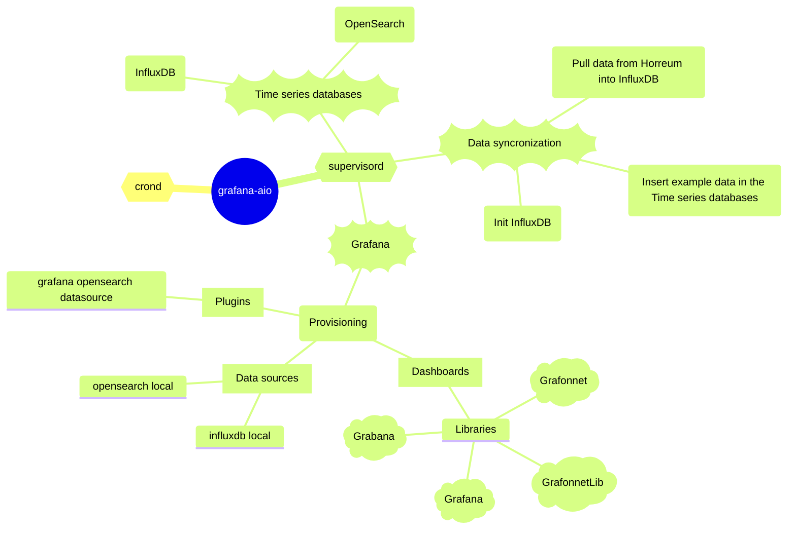
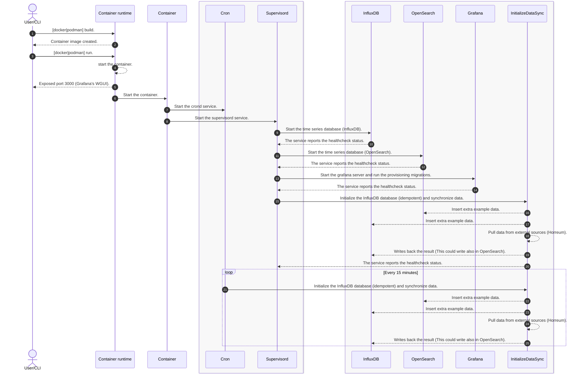

# grafana-aio (Grafana All In One)

## Table of Contents
1. [Introduction](#introduction)
2. [Getting Started](#getting-started)
3. [Components](#components)
4. [Workflow](#workflow)
5. [Code hints](#code-hints)
6. [Comparison](#comparison)
7. [Final comments](#final-comments)

## Introduction

**[grafana-aio](https://github.com/ccamacho/grafana-aio)** is a Linux container that bundles a set of tools to store, and display time-series data. This bundle integrates the following tools:

- The dashboards

    - [Grafana](https://github.com/grafana/grafana): Grafana is an open-source platform for monitoring and observability, providing a versatile dashboard and analytics solution. It supports data visualization, metrics querying, and alerting, allowing users to create interactive and customizable dashboards for various data sources, such as Prometheus, InfluxDB, and Elasticsearch. Grafana facilitates real-time analysis, performance monitoring, and data-driven decision-making. With a user-friendly interface, it enables organizations to gain insights into their systems, applications, and infrastructure. As a widely adopted tool in the DevOps and monitoring community, Grafana plays a crucial role in visualizing and understanding complex data to enhance operational efficiency and reliability.

- The time series backends

    - [OpenSearch](https://github.com/opensearch-project): OpenSearch is an open-source search and analytics engine designed for scalability and high-performance retrieval of structured and unstructured data. It is a fork of Elasticsearch, providing powerful full-text search capabilities and distributed, RESTful, and JSON-based querying. OpenSearch is suitable for various use cases, including log analytics, business intelligence, and application search. With a flexible schema and extensive plugin ecosystem, it enables developers and organizations to build robust search and analytics solutions. Emphasizing transparency and community collaboration, OpenSearch is governed by the OpenSearch community, ensuring continued development and innovation in the realm of distributed search and analytics.

    - [InfluxDB](https://github.com/influxdata/influxdb): InfluxDB is an open-source, high-performance time-series database designed for handling large volumes of time-stamped data. It excels in storing, querying, and visualizing metrics and events generated by various applications and systems. InfluxDB supports a flexible data model, allowing efficient storage and retrieval of time-series data with high precision. It is widely used in monitoring, IoT, and analytics scenarios, offering a user-friendly query language (InfluxQL) and integration with popular visualization tools like Grafana. With its scalability and ease of use, InfluxDB empowers developers and organizations to gain valuable insights from time-series data, improving operational monitoring and decision-making processes.

- The libraries for rendering the JSON dashboards

    - [Grafonnet](https://github.com/grafana/grafonnet) and [Grafonnet-lib](https://github.com/grafana/grafonnet-lib): Grafonnet and Grafonnet-lib are JSONnet libraries that provides a programmatic way to define and generate Grafana dashboards using code. JSONnet is a data templating language, and Grafonnet and Grafonnet-lib leverages it to create reusable and modular components for Grafana dashboards. These libraries simplify the process of dashboard creation by abstracting complex JSON structures into a more concise and expressive format. The current and latest version of grafonnet have a limited support for plugins while grafonnet-lib has all of them integrated.

        - [Grafonnet](https://github.com/grafana/grafonnet): Grafonnet is a tool or library specifically designed for creating Grafana dashboards using JSONnet. It provides a higher-level abstraction, allowing users to express Grafana configurations more concisely and in a modular fashion.

        - [Grafonnet-lib](https://github.com/grafana/grafonnet-lib): Grafonnet-lib is a JSONnet library, a set of pre-built components and utilities, for creating Grafana dashboards. It is essentially a collection of reusable modules that can be imported and used within your JSONnet files to simplify the process of defining Grafana dashboards programmatically.

    - [Grabana](https://github.com/K-Phoen/grabana): Grabana provides a developer-friendly way of creating Grafana dashboards based in YAML, and the library is based in golang.

    - [Grafanalib](https://github.com/weaveworks/grafanalib): Grafanalib is a Python library for programmatically creating and managing Grafana dashboards. It simplifies the process of defining and configuring Grafana dashboards by allowing users to generate JSON specifications using Python code. This enables automation, version control, and easy replication of dashboards across environments. Grafanalib helps streamline the workflow for individuals and teams working with Grafana, providing a more structured and code-driven approach to dashboard creation and maintenance.

- The services orchestration

    - [Supervisor](https://github.com/Supervisor/supervisor): Supervisor is a Python-based process control system that simplifies the management of background processes. It ensures the automatic restart of failed processes, monitors their status, and provides a web-based user interface for control. Configuration is done through simple INI files, where users define processes to be managed, specify their startup parameters, and configure monitoring options. Supervisord's versatility makes it a popular choice for maintaining the stability and availability of applications by efficiently handling process lifecycle events. Overall, it serves as a reliable tool for process supervision and management in server environments.

    - [Cron](https://github.com/cronie-crond/cronie): Crond is a daemon in Unix-like operating systems responsible for executing scheduled tasks at predetermined intervals.

The goal of grafana-aio is to showcase how to install and configure the stack, how to build static dashboards, how to import data from external sources by creating some random example data in the data sources, and how to display the dashboards in Grafana.
This tool will also serve as a comparison for understanding the capabilities, current support and ease of adoption of the different tools to render the dashboards programmatically.

## Getting Started

This section provides a step-by-step guide on how to get started with grafana-aio.

### Pre requisites
A container runtime like podman or docker to run a container.

1. Building from sources, get the code, build the container image, and run the container:

```bash
git clone https://github.com/ccamacho/grafana-aio
cd grafana-aio

docker build -t grafana-aio .

docker run \
    -p 3000:3000 \
    grafana-aio
```

2. Or pull and run the image with the latest changes from the GitHub container registry.

```bash
docker run \
    -p 3000:3000 \
    --pull always \
    --add-host this.is.a.host.example.com:1.2.3.4 \
    ghcr.io/ccamacho/grafana-aio:latest
```

Depending on your host configuration, include any host address not resolved by your DNS provider.

## Components

The following diagram describes how all the components are integrated:



Ideally all the previous components should run independently in separate containers and orchestrated by a container orchestration system like OpenShift but the goal is to quickly start a container with the requirements to display the dashboards directly.

## Workflow

The following sequence diagram describes all the steps that are executed when the grafana-aio container is running.



## Code hints

- Where is defined the default Grafana username and password?: The default username and password is configured in the main Grafana [configuration file](https://github.com/ccamacho/grafana-aio/blob/main/config/grafana.ini#L4-L5).

- Where is the cron job defined?: The cron is defined in the [configuration file](https://github.com/ccamacho/grafana-aio/blob/main/config/cron.conf).

- Where is defined the default OpenSearch username and password?: The default username and password is set by default `admin:admin`.

- Where is the supervisord configuration?: The supervisord configuration is in the [config folder](https://github.com/ccamacho/grafana-aio/blob/main/config/supervisord.conf)

- Where are the dashboards defined?: All the dashboards are stored in the `custom_dashboards` [folder](https://github.com/ccamacho/grafana-aio/tree/main/custom_dashboards). Depending on the library you will like to use there are specific examples:

    - All the grabana dashboards must end with `*.dashboard.yml`.
    - All the grafonnet and grafonnet-lib dashboards must end with `*.dashboard.jsonnet`.
    - All the grafanalib dashboards must end with `*.dashboard.py`.
    
    Any other file in the `custom_dashboards` will be skipped when rendering the dashboards, this might be useful when a local import is required.

    Grafana does not allow to keep a tree-like hierarchical structure when creating the dashboards so you will only see listed the parent folder of the dashboards you have.

- Where are defined the `provisioning` assets for grafana?: The are stored in the `provisioning` [folder](https://github.com/ccamacho/grafana-aio/tree/main/provisioning).

- Where is initialized the InfluxDB instance?: The InfluxDB instance is initialized when running the `initialize_data_sync.sh` [script](https://github.com/ccamacho/grafana-aio/blob/main/scripts/initialize_data_sync.sh).

- Where are the InfluxDB credentials defined?: The credentials are defined in the `influxdb_connect.py` [script](https://github.com/ccamacho/grafana-aio/blob/main/scripts/influxdb_connect.py), this script is called from the `initialize_data_sync.sh` [script](https://github.com/ccamacho/grafana-aio/blob/main/scripts/initialize_data_sync.sh) the first time the container starts.

- Any more questions?: [Create an issue](https://github.com/ccamacho/grafana-aio/issues/new).

## Comparison


<table>
<thead>
  <tr>
    <th rowspan="2">Feature</th>
    <th colspan="4">Libraries</th>
  </tr>
  <tr>
    <th>grafonnet</th>
    <th>grafonneet-lib</th>
    <th>grafanalib</th>
    <th>grabana</th>
  </tr>
</thead>
<tbody>
  <tr>
    <td>Support for graphs*</td>
    <td>Yes</td>
    <td>Yes</td>
    <td>Yes</td>
    <td>Yes</td>
  </tr>
  <tr>
    <td>Support for timeseries*</td>
    <td>Yes</td>
    <td>No</td>
    <td>Yes</td>
    <td>Yes</td>
  </tr>
  <tr>
    <td>Support for candlesticks*</td>
    <td>Yes</td>
    <td>No</td>
    <td>No</td>
    <td>No</td>
  </tr>
  <tr>
    <td>Support for an InfluxDB target*</td>
    <td>Yes</td>
    <td>Yes</td>
    <td>Yes</td>
    <td>No</td>
  </tr>
  <tr>
    <td>Support for an OpenSearch target*</td>
    <td>Not fully tested</td>
    <td>Not fully tested</td>
    <td>Not fully tested</td>
    <td>Not fully tested</td>
  </tr>
  <tr>
    <td>Usability **</td>
    <td>2</td>
    <td>2</td>
    <td>5</td>
    <td>5</td>
  </tr>
  <tr>
    <td>Maintainability **</td>
    <td>5</td>
    <td>0</td>
    <td>3</td>
    <td>1</td>
  </tr>
  <tr>
    <td>Support **</td>
    <td>5</td>
    <td>0</td>
    <td>3</td>
    <td>0</td>
  </tr>
  <tr>
    <th align="left" colspan="6">*: Support for rendering JSON objects; **: 1 - 5 higher is better</th>
  </tr>
</tbody>
</table>

### Review

- Time series databases

    - **InfluxDB**: Good support, stable Python client, easy to install and configure. +++++ Adviced to use.

    - **OpenSearch**: Good support, stable Python client, easy to install and configure. +++++ Adviced to use (Still pending to include some examples using this datasource).

- Libraries for rendering the dashboards JSON code

    - **grafanalib**: Easy to use (Python), it looks like is in maintenance mode, not many contributors (or any), latest Pypi release from 2022, do not depend on critical dashboards. ++ Use with precaution.

    - **grabana**: Easiest to use (YAML), not many Grafana components supported, looks like is in maintenance mode, do not depend on critical dashboards. ++ Use with precaution.

    - **grafonnet-lib**: Complex DSL (JSONnet), this repository is deprecated, it is replaced with an (generated) [version](https://github.com/grafana/grafonnet). ++ Use with precaution.

    - **grafonnet**: Complex DSL (JSONnet), supported by Grafana, JSONnet library for generating Grafana dashboards, still sorting out how to migrate all the plugins from grafonnet-lib. +++++ Adviced to use.

## Final comments

- Adoption and deprecated libraries: Be careful when using libraries to define the dashboards, some of them might be deprecated, in maintenance mode, or not updated at all.

- Scalability: **grafana-aio** is not meant to run in production environments, there might be thousands or millions data entries that will just not be handled by this container. This project serves to show how to create the dashboards, or how to pull data specifically for generating reports in Grafana.

- Prometheus as an additional datasource: It looks like Prometheus is supported everywhere, but to support this new data store we will also need to integrate and additional backend to be able to push data in the datastore using a python library. Prometheus includes a local on-disk time series database, but also optionally integrates with remote storage systems. Prometheus's local time series database stores data in a custom, highly efficient format on local storage. To do this something like [Mimir](https://github.com/grafana/mimir) will also need to be included.

- Grafana organization: No tree-like nested [folders in grafana for dashboards](https://github.com/grafana/grafana/issues/10339).
