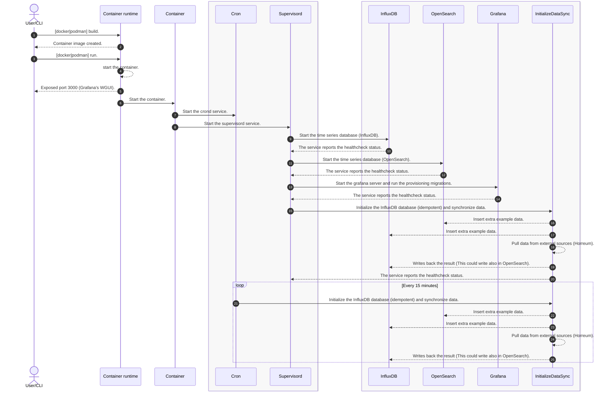

# Grafonnet Documentation

Welcome to the Grafonnet documentation. Grafonnet is a Jsonnet library for generating Grafana dashboards.

## Table of Contents
1. [Introduction](#introduction)
2. [Getting Started](#getting-started)
3. [Library Overview](#library-overview)
4. [Usage Examples](#usage-examples)
5. [Best Practices](#best-practices)
6. [FAQ](#faq)
7. [Contributing](#contributing)
8. [License](#license)

## Introduction

Grafonnet is a Jsonnet library that simplifies the process of generating Grafana dashboards. This document provides an introduction to Grafonnet and its key features.

### What is Grafonnet?

Grafonnet is...

## Getting Started

This section provides a step-by-step guide on how to get started with Grafonnet.

### Prerequisites

Before you begin, make sure you have the following prerequisites...

## Library Overview

Grafonnet provides a comprehensive set of features and functions for creating Grafana dashboards. This section provides an overview of the library's structure and capabilities.

### Components of Grafonnet

Grafonnet consists of...

## Usage Examples

Explore practical examples to understand how to use Grafonnet effectively.

### Example 1: Creating a Simple Dashboard

In this example, we will...

Evaluating

## grafanalib
## grabana
## grafonnet
## grafonnet-lib

## Best Practices

Follow these best practices to optimize your use of Grafonnet and create maintainable and efficient dashboards.

### Tip 1: Organize Your Code

...

## FAQ

Find answers to common questions about Grafonnet in this FAQ section.

### Question 1: How do I...

...

## Contributing

We welcome contributions from the community. If you'd like to contribute to Grafonnet, please follow the guidelines outlined in this document.

### How to Contribute

...

## License

Grafonnet is licensed under the...

...

git clone https://github.com/ccamacho/topsail-grafana

cd topsail-grafana/grafana

docker build \
    --add-host horreum.corp.redhat.com:10.1.184.215 \
    -t topsail-cpt-grafana .

# The only port exposed is the Grafana's web
# interface port, all the other services are internal
# and meant to pull data
docker run \
    -p 3000:3000 \
    --add-host horreum.corp.redhat.com:10.1.184.215 \
    topsail-cpt-grafana \
    --add-host cpt-dashboard-topsail-cpt-dashboard-testing.apps.psap-watsonx-dgxa100.perf.lab.eng.bos.redhat.com:10.16.30.31 \
    --add-host cpt-dashboard-backend-topsail-cpt-dashboard-testing.apps.psap-watsonx-dgxa100.perf.lab.eng.bos.redhat.com:10.16.30.31 \
    --add-host opensearch-topsail-cpt-dashboard-testing.apps.psap-watsonx-dgxa100.perf.lab.eng.bos.redhat.com:10.16.30.31 \
    --add-host opensearch-dashboards-topsail-cpt-dashboard-testing.apps.psap-watsonx-dgxa100.perf.lab.eng.bos.redhat.com:10.16.30.31

- cron
- supervisord
- grafana
- provisioning
- influxdb

File structure

influx config
influx auth list --json | jq .token

influx v1 dbrp create \
--db psap \
--rp autogen \
--bucket-id 9038d9f463e6adcb \
--default

influx v1 auth create \
  --read-bucket 9038d9f463e6adcb \
  --write-bucket 9038d9f463e6adcb \
  --username psap \
  --password this_is_a_very_long_password

influx bucket list
influx v1 dbrp list
influx v1 auth list

No nested folders in grafana for dashboards: https://github.com/grafana/grafana/issues/10339
